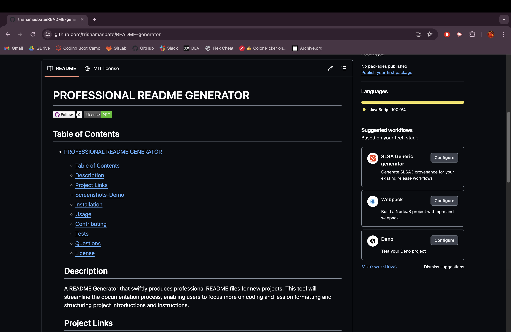

 
  # PROFESSIONAL README GENERATOR

  
  

  ## Table of Contents
- [PROFESSIONAL README GENERATOR](#professional-readme-generator)
  - [Table of Contents](#table-of-contents)
- 
  - [Description](#description)
  - [Project Links](#project-links)
  - [Screenshots-Demo](#screenshots-demo)
  - [Installation](#installation)
  - [Usage](#usage)
  - [Contributing](#contributing)
  - [Tests](#tests)
  - [Questions](#questions)
  - [License](#license)
  #

  ## Description
  A README Generator that swiftly produces professional README files for new projects. This tool will streamline the documentation process, enabling users to focus more on coding and less on formatting and structuring project introductions and instructions.

  ##  Project Links
  https://github.com/trishamasbate/README-generator 

  [YOUTUBE Professional README Generator Workflow](https://youtu.be/ldYhGwLixi4?si=UgZnZBNKDdmwLLGU)

  [SCREENCASTIFY Professional README Generator Workflow](https://watch.screencastify.com/v/NIOT2FwR8IAXLgiC5cGA)
  
  ## Screenshots-Demo
  <kbd></kbd>
  
  ## Installation
  Clone the repository using the Project Link above! 🙌🏻

  ## Usage 
  1. Run the Terminal.
  2. Install the Inquirer Package ver. 8.2.4 by typing "npm i inquirer@8.2.4".
  3. Type "node index.js".
  4. Supply the answers to the questions.
  
  ## Contributing
  Please visit GitHub Docs for guidance: https://docs.github.com/en/contributing

  ## Tests
  npm test

  ## Questions
  Contact the author with any questions! 
  Github link: [trishamasbate](https://github.com/trishamasbate) 
  Email: trisha.masbate@gmail.com

  ## License
  This project is [MIT](https://choosealicense.com/licenses/mit/) licensed. 

  Copyright © 2024 [TRISHA MASBATE](https://github.com/trishamasbate)
  
  

  
<i>
  All the best! ♥️ TRISHA MASBATE
  </i>

  
